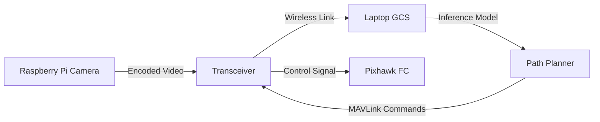

A custom-built Vertical Take-Off and Landing (VTOL) Unmanned Aerial Vehicle designed for fully autonomous missions. This project integrates embedded systems, real-time telemetry, and computer vision to create a drone capable of self-correction and intelligent pathfinding.

## 🛰️ System Architecture

The system is split into two main components: the **Onboard Flight Systems** and the **Ground Control Station**.

### Onboard Hardware
- **Compute**: Raspberry Pi 4 (8GB) handling high-level logic and video encoding.
- **Flight Controller**: Pixhawk running ArduPilot for low-level stabilization.
- **Communication**: LoRa Transceiver for long-range telemetry and RC control.
- **Sensors**: GPS, Barometer, IMU, and a dedicated Pi Camera for visual input.

### Ground Control Station (GCS)
The "brain" of the autonomy stack resides on a high-performance laptop acting as the GCS. 
1. **Telemetry Link**: Receives mavlink packets via the transceiver.
2. **Video Stream**: Decodes low-latency video feed transmitted from the RPi.
3. **Inference Engine**: Runs object detection and path planning algorithms on the GPU.
4. **Command Relay**: Sends corrected flight vectors back to the UAV in real-time.

## 🧠 The Autonomy Pipeline

The core challenge was closing the loop between visual perception and flight control over a wireless link.

### 1. Visual Navigation
The Raspberry Pi streams 720p video to the GCS. Using **OpenCV** and a custom **YOLO** model, the laptop identifies landing zones and obstacles. The decision to offload processing to the ground station allowed for much heavier models than the Pi could run onboard.

### 2. Control Loop
Once a target is identified, the laptop calculates the necessary roll, pitch, and yaw adjustments. These are converted into **MAVLink** commands and sent back to the drone. The latency was optimized to be under 100ms to ensure stable flight characteristics.

## 🚧 Challenges

### Bandwidth vs. Latency
Streaming video and telemetry simultaneously over a limited bandwidth radio link required aggressive compression. I implemented a custom UDP protocol to prioritize the latest frame, dropping dropped packets immediately rather than re-requesting them.

### Failsafe Mechanisms
Reliance on a ground station introduces a critical point of failure: connection loss. To mitigate this, the onboard Raspberry Pi runs a lightweight "Keep-Alive" watchdog. If the link is severed for more than 500ms, the drone automatically switches to a "Return to Launch" (RTL) mode using its onboard GPS.

## 🔮 Future Improvements
- **Onboard Edge AI**: Moving inference to a Coral Edge TPU to remove the dependency on the ground station.
- **Swarm Logic**: Enabling communication between multiple UAVs for coordinated formation flight.
